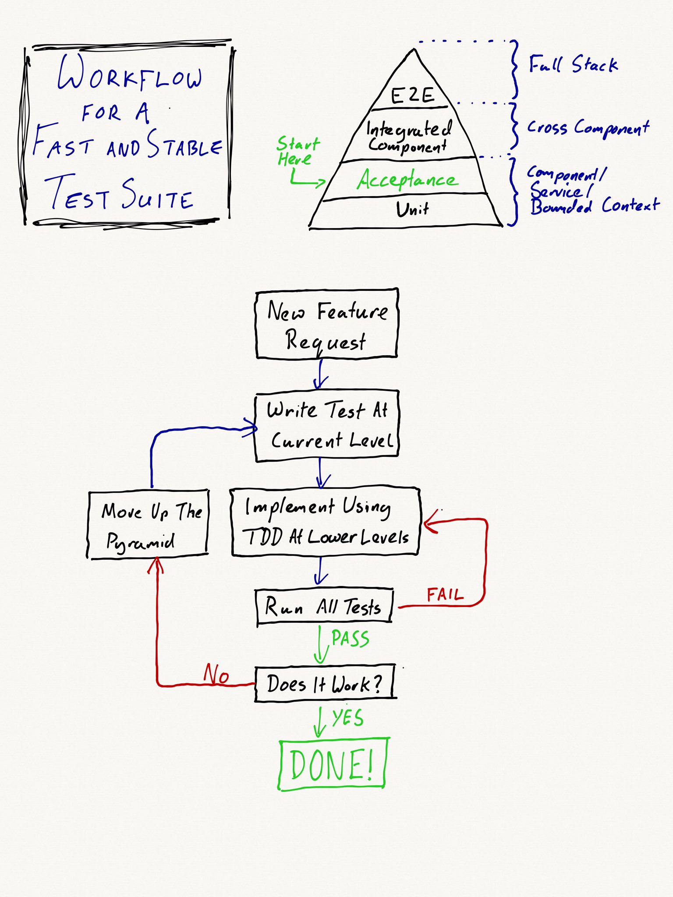

# Climbing the Test Pyramid

In this modern day of software development, we've learned that the best way to
deliver high quality software we must work in an Agile way. To do this we need
quick feedback back so that we can adjust and learn as fast as possible. We
optimise the feedback cycle time at the smallest level with TDD and at the
largest level with Continuous Deployment.

We also know that in order to release fast and often, we need a test suite which
gives us complete confidence so that we don't release broken software.

With this knowledge, the problem which many people are struggling with at the
moment is slow test suites, which in turn, makes the build pipelines slow,
painful and expensive.

Thankfully there are a number of very clever people who are currently sharing
important information (at conferences and in books and articles) about building
architechtures which allow this problem to be solved. This is done by favouring
isolated, targeted tests at lowest levels, over slow, all encompassing
end-to-end tests.

The concern that this raises in a lot of people, is how to you maintain the
confidence that these lower level tests give you the confidence in the system
when you are not testing everything completely with end-to-end acceptance tests?

For some years now, I've been developing software in this way and I feel that I
have now learned a workflow which gives complete complete confidence in the test
suite, and fast build pipelines. This article presents the simple rules of this
workflow.

[Jump straight to the rules](#the-rules)
  
## Introducing the Test Pyramid

The Test Pyramid was created quite some time ago by Mike Cohn. It looks like
this.
      
         /\
        /UI\
       /----\
      /Service
     /--------\
    /___Unit___\
 
Each layer describes a level of testing in a the project. The bottom level
contains the smallest, most targeted tests, which are the fastest to run. The
top level contains the tests which prove the system behaviour by testing the
whole system - the tests can be very slow.

In order to make the test suite fast, you want to create more tests in the lower
levels, which give the confidence to have less in the higher levels. How to do
this is the focus of this article.

It's worth noting some important properties of the test pyramid:

fast   general   expensive     /\
 |       |          |         /  \
slow  focussed    cheap      /____\ 
                           |no tests|

_You can only have confidence in a layer if you have complete confidence in all the layers below._

The actual names of the layers and the number of layers may vary depending on
your achitecture, but these properties and the rules I'm about to present still
apply.

## The Rules

I'm going to introduce the rules now. The rest of this artice, beyond the rules,
explains and demostrates how and why they work.

1. Always start a implementing a system behaviour by writing a test at the
   lowest level where it can be described in a single test.
  
2. If a test is red, make it green by applying outside-in TDD down into the
   lower levels.
  
3. Only if all tests are green and the system behaviour is still not working,
   climb up to the next level of the and write a new failing test.
  
The workflow for applying these rules looks like this:



In my experience, these rules, use with a supporting architure (like the one
described in
[this talk](https://skillsmatter.com/skillscasts/8567-testable-software-architecture)),
have always lead me to a fast and stable test suite which gives me the
confidence I need.

In the rest of the article I will attempt to show why by working through an
example.

## The Example

For this example, we'll work through the process of creating a small system
which calculates wages from hours worked.

For this application, the UI layer will be a HTML webpage, the Service layer
will be a a set of classes which represent the actions which can be performed
on the system, and the Unit layer is made up of all the classes which make up
the domain model. All communication between the UI and Unit layers will go via
the Service layer.

### The First Behaviour

The first thing we need the system to do is calculate the wagers from the
number of hours worked. To start with, let's create a single scenario which
describes this behaviour:

```gherkin
Scenario: Pay wages for the number of hours worked in a week
  Given Kevin gets paid £10 per hour
  And Kevin has work for the following times this week:
    | Day        | Start | End   |
    | 2016-11-14 | 09:00 | 17:00 |
    | 2016-11-15 | 09:00 | 13:00 |
    | 2016-11-17 | 14:00 | 17:00 |
  When I pay Kevin's wages for the week for the week starting on 2016-11-14
  Then Kevin should get £140 for the week starting on 2016-11-14
```

This is too complicated to create a single unit test for, but it could be
applied at both the UI and the Service levels. By applying the **first rule**,
we choose the lowest level and write some steps which look something like this:

```php
/**
 * @Given Kevin gets paid £:amount per hour
 */
public function setKevinsRate(Money $amount)
{
    $command = new EmployeeDayRate($this->kevin, $amount);
    $this->commandBus->run($command);
}

/**
 * Given Kevin has work for the following times this week:
 */
public function logKevinsWorked(TableNode $entries)
{
    foreach ($entries->getHash() as $entry) {
        $command = new LogWork(
          $this->kevin,
          Date::fromString($entry['Day']),
          Time::fromString($entry['Start']),
          Time::fromString($entry['End'])
        );
        $this->commandBus->run($command);
    }
}

/**
 * @When I calculate Kevin's wages for the week for the week starting on :weekStart
 */
public function calculateKevinsWages(Date $weekStart)
{
    $command = PayWeeklyWagers($this->kevin, $weekStart);
    $this->commandBus->run($command);
}

/**
 * @Then Kevin should get £:amount for the week starting on :weekStart
 */
public function checkKevinsWagersForAWeek(Money $amount, Date $weekStart)
{
    $query = CheckEmployeeWagersForAWeek($weekStart);
    $result = $this->queryRunner($query);

    assertEquals($amount, $result->getAmount());
}
```

This test is now red because there is no implementation yet. To implement it we
can apply the **second rule** by using the TDD cycle to write unit tests and drive
the development of domain model.

Once all the tests are green, we can consider **rule three**. Since there is no
user interface at this point, we can consider this test incomplete. Therefore,
we can drive the creation of the user interface by climbing up the pyramid one
level to the UI tests.

A neat way to do this is to re-use the same Gherkin scenario, but with new
steps. These new might looks like this:

```php
/**
 * @Given Kevin gets paid £:amount per hour
 */
public function setKevinsRate(Money $amount)
{
    $this->visit('/');
    $this->clickLink('Set Employee Rate');
    $this->clickLink('Kevin');
    $this->fillField('rate', $amount->getValue());
    $this->pressButton('Update');
}

/**
 * Given Kevin has work for the following times this week:
 */
public function logKevinsWorked(TableNode $entries)
{
    $this->visit('/');
    $this->clickLink('Set Employee Rate');
    $this->clickLink('Kevin');

    foreach ($entries->getHash() as $entry) {
        $this->fillField('day', $entry['Day']);
        $this->fillField('start', $entry['Start']);
        $this->fillField('end', $entry['End']);

        $this->pressButton('Log Work');
    }
}

/**
 * @When I calculate Kevin's wages for the week for the week starting on :weekStart
 */
public function calculateKevinsWages(Date $weekStart)
{
    $this->visit('/');
    $this->clickLink('Calcuate Wages for Week');
    $this->clickLink('Kevin');
    $this->fillField('week', $weekStart->getValue());
    $this->pressButton('Cacluate');
}

/**
 * @Then Kevin should get £:amount for the week starting on :weekStart
 */
public function checkKevinsWagersForAWeek(Money $amount, Date $weekStart)
{
    $this->assertPageHasText("Wages for week starting $weekStart: $amount");
}
```

This test can now be used to drive the implementation of the user interface.

Once all the tests are green, we can manually check the behaviour of the system
and confirm that the task is complete.

### Second Behaviour
